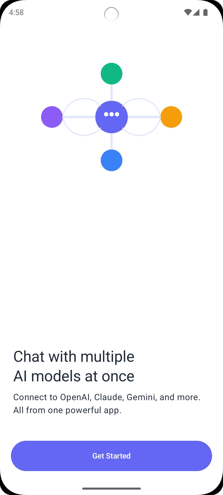

# MultiGPT

A native Android app for chatting with multiple AI models simultaneously.

[](https://android.com)
[](https://kotlinlang.org)
[](https://developer.android.com/jetpack/compose)
[](LICENSE)

<p>
  <a href="https://play.google.com/store/apps/details?id=com.matrix.multigpt">
    
  </a>
</p>

## Overview

MultiGPT allows users to communicate with multiple AI providers (OpenAI, Anthropic, Google, Groq, AWS Bedrock, Ollama) within a single conversation interface. Built with modern Android development practices using Kotlin, Jetpack Compose, and MVVM architecture.

## 📱 Screenshots

<div align="center">

### App Introduction & Setup
|                            Getting Started                            |                               Settings                                |                              API Config                               |
|:---------------------------------------------------------------------:|:---------------------------------------------------------------------:|:---------------------------------------------------------------------:|
|  |  |  |

|                            Model Selection                            |                             Custom Prompt                             |                              Chat Screen                              |
|:---------------------------------------------------------------------:|:---------------------------------------------------------------------:|:---------------------------------------------------------------------:|
|  |  |  |

### Key Features Shown:
- **Screenshot 1**: Welcome screen and app introduction
- **Screenshot 2**: AI platform selection and configuration
- **Screenshot 3**: API key setup and credential management
- **Screenshot 4**: Settings menu with all available options
- **Screenshot 5**: Theme selection and appearance customization
- **Screenshot 6**: Multi-model chat interface in action

</div>

## Technical Stack

### Architecture
- **Pattern**: MVVM with Clean Architecture
- **UI Framework**: Jetpack Compose with Material Design 3
- **Dependency Injection**: Hilt
- **Database**: Room with SQLite
- **Preferences**: DataStore
- **Networking**: Ktor HTTP client
- **Async**: Kotlin Coroutines and Flow

### Project Structure
```
app/src/main/kotlin/com/matrix/multigpt/
├── data/                 # Data layer
│   ├── database/         # Room database entities and DAOs
│   ├── datastore/        # DataStore preferences
│   ├── dto/              # Data transfer objects for APIs
│   ├── model/            # Domain models
│   ├── network/          # API client implementations
│   └── repository/       # Repository implementations
├── di/                   # Hilt dependency injection modules
├── presentation/         # UI layer
│   ├── common/           # Shared UI components
│   ├── theme/            # Material Design 3 theming
│   └── ui/               # Feature-specific UI screens
└── util/                 # Utility classes and extensions
```

## Development Setup

### Prerequisites
- Android Studio Hedgehog (2023.1.1) or newer
- Android SDK 34+ (API level 34)
- Kotlin 1.9+
- JDK 17+

### Building the Project

1. **Clone the repository**
   ```bash
   git clone https://github.com/it5prasoon/MultiGPT.git
   cd MultiGPT
   ```

2. **Open in Android Studio**
   - Import the project into Android Studio
   - Let Gradle sync complete

3. **Build and Run**
   ```bash
   ./gradlew assembleDebug
   ./gradlew installDebug
   ```

### Firebase Configuration (Optional)
If building from source, you can add your own `google-services.json` for Firebase integration:
1. Create a Firebase project at [Firebase Console](https://console.firebase.google.com/)
2. Download `google-services.json`
3. Place it in `app/` directory

### AdMob Configuration (Optional)
For ads, create `app/src/main/res/values/ad_mob_config.xml`:
```xml
<?xml version="1.0" encoding="utf-8"?>
<resources>
    <string name="admob_app_id">your_admob_app_id</string>
    <string name="home_banner">your_banner_ad_id</string>
    <string name="setup_complete_interstitial">your_interstitial_ad_id</string>
</resources>
```

## API Integration

The app integrates with multiple AI providers through their REST APIs:

### Supported Providers
- **OpenAI**: GPT-4o, GPT-4o mini, GPT-4 Turbo, GPT-4
- **Anthropic**: Claude 3.5 Sonnet, Claude 3 Opus, Claude 3 Sonnet, Claude 3 Haiku
- **Google**: Gemini 1.5 Pro, Gemini 1.5 Flash, Gemini 1.0 Pro
- **Groq**: Llama 3.1, Llama 3.2, Gemma 2
- **AWS Bedrock**: Multiple foundation models from various providers
- **Ollama**: Local AI models via self-hosted API

### Dynamic Model Fetching
The app automatically discovers available models from each provider:
- Fetches current model lists via API
- Falls back to curated lists if fetching fails
- Supports custom model names for advanced users

### API Client Architecture
```kotlin
interface AIProviderAPI {
    @POST("v1/chat/completions")
    suspend fun createCompletion(
        @Body request: CompletionRequest
    ): CompletionResponse
}

// Implementation example
@Singleton
class OpenAIAPIImpl @Inject constructor(
    private val httpClient: HttpClient
) : OpenAIAPI {
    // API implementation
}
```

## Database Schema

### Entities
- **ChatRoom**: Conversation metadata and enabled AI providers
- **Message**: Individual messages with provider attribution

### Room Database
```kotlin
@Database(
    entities = [ChatRoom::class, Message::class],
    version = 1
)
abstract class ChatDatabase : RoomDatabase() {
    abstract fun chatRoomDao(): ChatRoomDao
    abstract fun messageDao(): MessageDao
}
```

## Security & Privacy

### Data Storage
- All conversations stored locally using Room database
- API keys encrypted using DataStore with encryption
- No data transmitted to external servers except AI providers

### API Key Management
```kotlin
// Secure storage implementation
class SettingDataSourceImpl @Inject constructor(
    private val dataStore: DataStore<Preferences>
) {
    suspend fun updateToken(apiType: ApiType, token: String) {
        dataStore.edit { preferences ->
            preferences[apiTokenMap[apiType]!!] = token
        }
    }
}
```

## Testing

### Running Tests
```bash
# Unit tests
./gradlew test

# Instrumented tests (requires device/emulator)
./gradlew connectedAndroidTest

# Test coverage
./gradlew jacocoTestReport
```

### Test Structure
```
app/src/test/kotlin/com/matrix/multigpt/
├── data/
│   └── repository/       # Repository tests
└── presentation/         # ViewModel tests
```

## CI/CD

The project uses GitHub Actions for continuous integration:
- **CodeQL Security Analysis**: Automated vulnerability scanning
- **Debug Builds**: APK generation for pull requests
- **Release Builds**: Signed APK/AAB generation
- **Code Quality**: Kotlin linting with ktlint

### Workflows
- `codeql.yml`: Security analysis
- `debug-build.yml`: Debug APK generation
- `release-build.yml`: Release builds with signing
- `ktlint.yml`: Code formatting checks

## Localization

The app supports multiple languages through Android's localization system:
- `values/strings.xml` - Default (English)
- `values-ar/strings.xml` - Arabic
- `values-zh-rCN/strings.xml` - Chinese (Simplified)
- `values-ko-rKR/strings.xml` - Korean
- And more...

## Contributing

Please read [CONTRIBUTING.md](CONTRIBUTING.md) for development guidelines and [CODE_OF_CONDUCT.md](CODE_OF_CONDUCT.md) for community standards.

### Development Workflow
1. Fork the repository
2. Create a feature branch: `git checkout -b feature/amazing-feature`
3. Commit changes: `git commit -m 'Add amazing feature'`
4. Push to branch: `git push origin feature/amazing-feature`
5. Open a pull request

### Code Style
- Follow [Kotlin Coding Conventions](https://kotlinlang.org/docs/coding-conventions.html)
- Use [ktlint](https://ktlint.github.io/) for formatting
- Write KDoc comments for public APIs
- Include unit tests for new features

## License

This project is licensed under the MIT License - see the [LICENSE](LICENSE) file for details.

## Support

- **Issues**: [GitHub Issues](https://github.com/it5prasoon/MultiGPT/issues)
- **Discussions**: [GitHub Discussions](https://github.com/it5prasoon/MultiGPT/discussions)
- **Email**: [prasoonkumar008@gmail.com](mailto:prasoonkumar008@gmail.com)

---

**Note**: This is an open source project. For user-facing documentation and app features, see [SUPPORT.md](SUPPORT.md).
